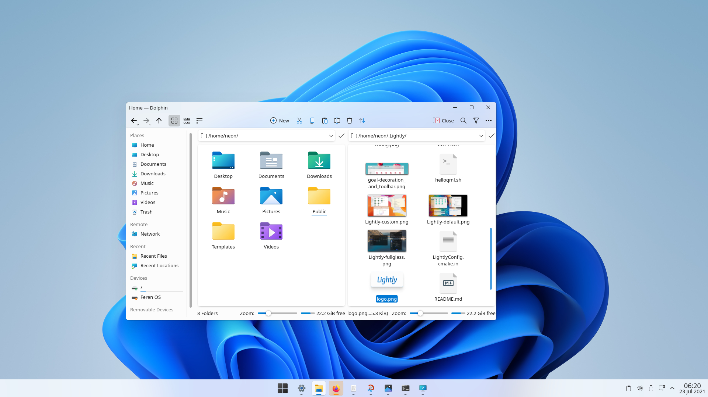
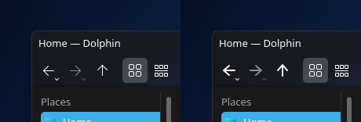

# willow-theme
A Windows 11 style demo for KDE Plasma.

## Set-up
Some of this may be automated in the future.

This guide is meant for people that want to get the most out of this theme.

### Application Style
**Lightly** will be needed for the blurred variant of this theme. You can view it and its installation instructions here: https://github.com/Luwx/Lightly
* General
	* Set corner radius to 5 px
* Frames
	* Uncheck "Transparent Dolphin view"
* Transparency
	* Drag the "Sidebars" slider to "Opaque"

### Icons
This theme uses yeyushengfan258's Win11 icon pack. You can download it in System Settings or manually install it from [here](https://www.pling.com/p/1546069/).

Icon packs are installed in your home directory at `~/.local/share/icons/`. Navigate to this folder and into the Win11 folder. Go to `actions/22/` and copy the icons from this repository (located at `willow-icons/actions/22/`) into there. Reapply the icon pack and you should now have Willow's icons.

Optionally, if you want thin arrows, you can copy the arrows in `22-optional-thin-arrows` into `actions/22/` instead.

### Dolphin File Manager
Dolphin, like all KDE software, is quite customisable. You can edit the toolbar by right-clicking it (right-click the hamburger menu in the top-right) and selecting "Configure toolbars..." in the menu. In the configuration window there will be your current toolbar's tools in the right pane. To get the appearance in the screenshot, first remove the item named "Location Bar" from the right pane. The following is taken from the screenshot:

* Back
* Forward
* Up
* separator
* Icons
* Compact
* Details
* -- expanding spacer --
* Create New
* Cut
* Copy
* Paste
* Rename...
* Sort By
* Move to Trash
* -- expanding spacer --
* Split
* Search
* Filter

You can select these and change or hide the text it shows next to its icon.

I recommend the following only if you wish to sacrifice utility for aesthetics. Normally, the Location Bar will let you drag and drop files in any of its shown directories.

To get the look in the screenshot, open the hamburger menu and select "Configure Dolphin..." and then go to Startup > New windows > Check the "Make location bar editable" box.

### Window Decorations
KDE has a theme engine called Aurorae. Like with the Plasma Style themes, it converts `.svg` files into UI elements. Themes are stored at `~/.local/share/aurorae/themes/`. With some basic Inkscape knowledge, you can make your own assets. Willow only comes with 3 available window buttons (minimize, maximize/restore, and close), but all of them are very easy to edit without a lot of work. Do not change anything inside the document page. You can read about the available buttons [here](https://techbase.kde.org/User:Mgraesslin/Aurorae#Buttons).

To set up the window decorations, choose "blur" if you are using Lightly or just choose the regular one if you are using Breeze or other opaque theme. A decoration is also included for the "Lightly" color scheme.

"Window border size:" should be set to "No Side Borders" for best results.

Under the "Titlebar Buttons" tab, I have removed "More actions for this window" for the appearance in the screenshot. You can still access the actions by right-clicking the titlebar.

*Tip: Until Aurorae gets support for a blur mask, you can fix the ["Korners" bug](https://bugs.kde.org/show_bug.cgi?id=395725) by using [a-parhom's fork of Lightly Shaders](https://github.com/a-parhom/LightlyShaders). Set the Window Decoration to "No borders" and remove "More actions for this window" to prevent clipping of the icon. Shader settings are in Workspace Behavior > Desktop Effects, under the "Appearance" section. Use roudness at 2 ticks with "Outline around window" checked.*

*Using shaders can affect performance of games and other applications. For opaque themes, you can just uncheck Blur.*

### Plasma Style
KDE's Plasma desktop uses `.svg` files to draw UI elements. This includes your panel/taskbar and analog clock. Themes are stored in `~/.local/share/plasma/desktoptheme/`. To change the appearance of a Plasma Style, you can swap assets from different themes. If you know how to use Inkscape, you can make your own custom theme by following this tutorial [here](https://develop.kde.org/docs/plasma/theme/quickstart/).

To have larger icons on your panel, set the height to 56px or go to the plasma theme's `readme.txt` to see available alternate versions of a file [e.g. here](https://github.com/doncsugar/willow-theme/tree/main/plasma-style/WillowDark).
